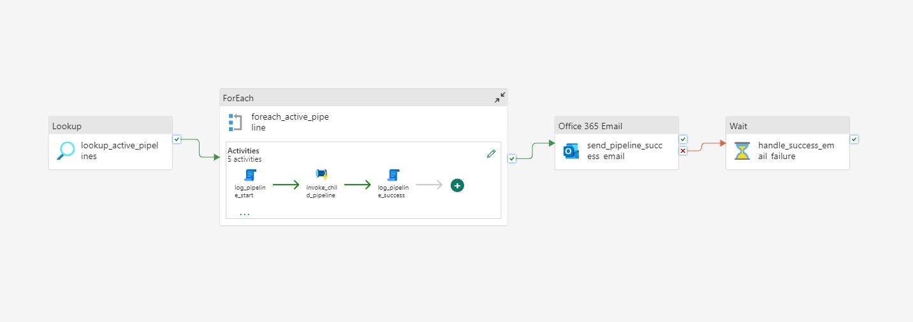
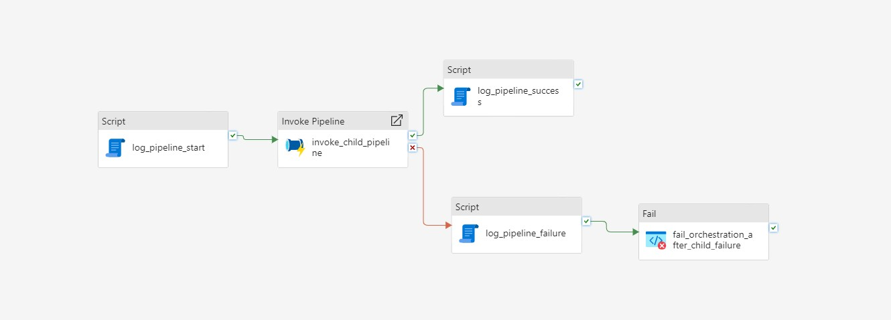
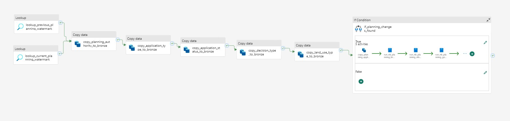
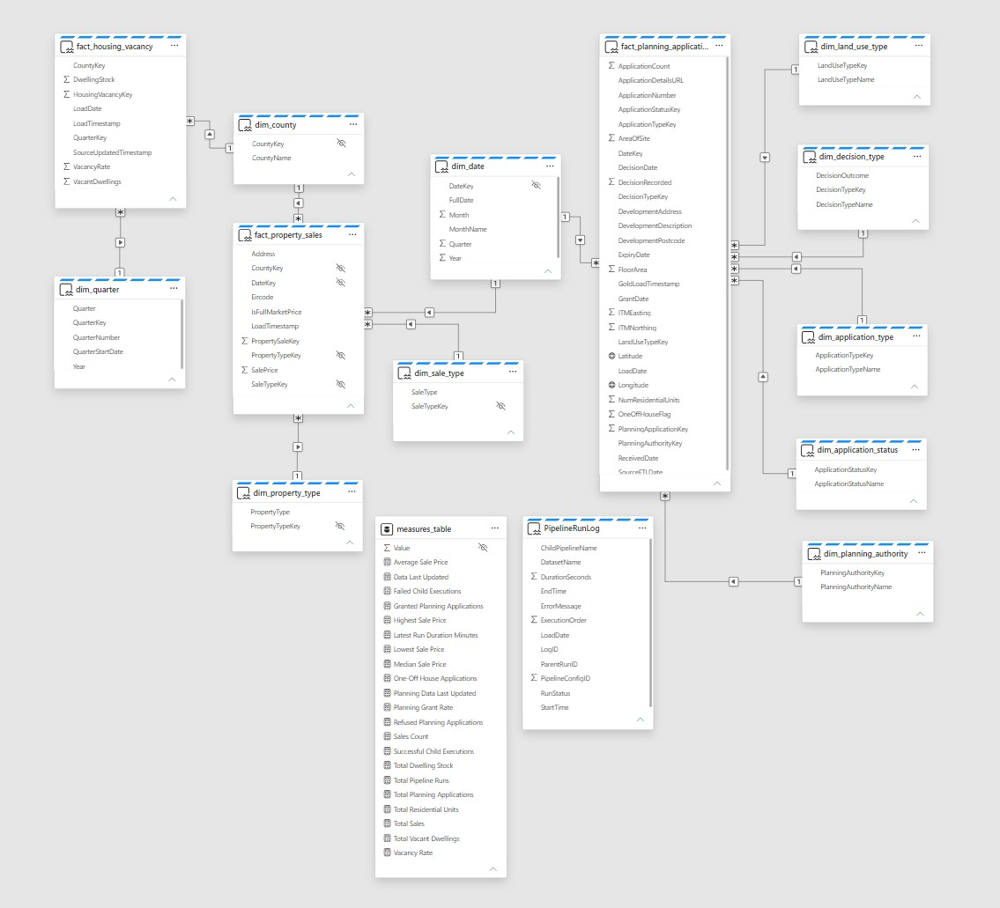
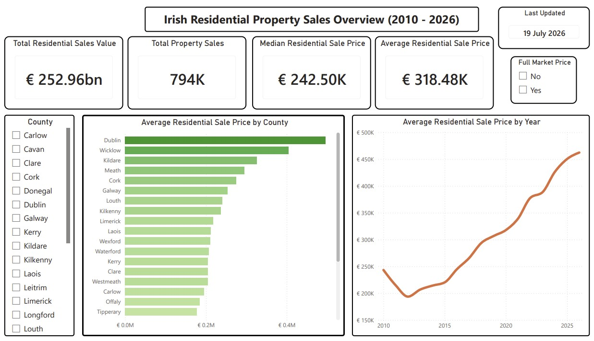
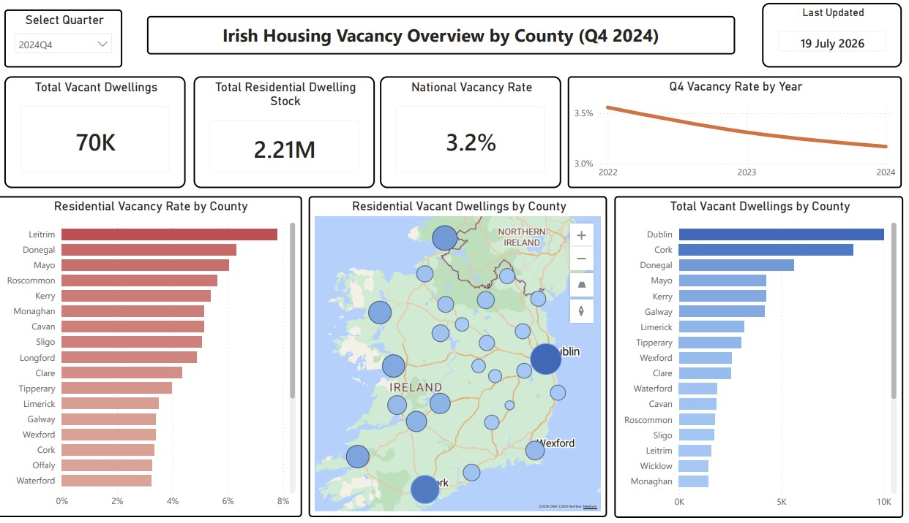
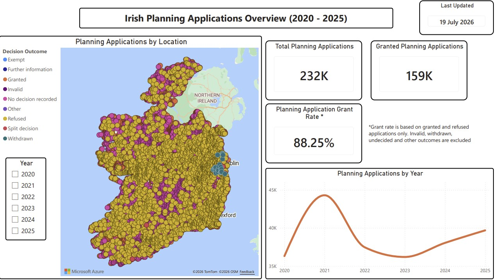
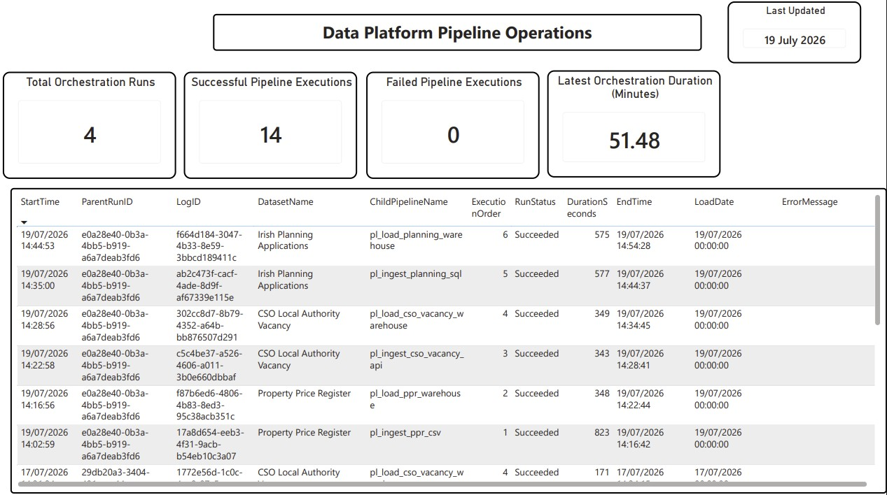

# Irish Housing Analytics Platform

An end-to-end data engineering platform for analysing Irish residential property sales, housing vacancy and planning applications.

## Project Overview

The platform processes three distinct data sources:

1. A complete Property Price Register CSV snapshot containing approximately 794,000 sales.
2. A CSO JSON-stat REST API providing local authority vacancy statistics.
3. A normalised on-premises SQL Server database containing 232,007 planning applications, accessed through a Microsoft data gateway.

The solution implements automated ingestion, parameterised PySpark transformations, Delta Lake processing, dimensional warehousing, semantic modelling, operational monitoring and Power BI reporting.

## Architecture

```text
Data Sources
     ↓
Microsoft Fabric Data Factory
     ↓
OneLake Bronze
     ↓
Silver Delta Tables
     ↓
Gold Business Tables
     ↓
Fabric Warehouse
     ↓
Semantic Model
     ↓
Power BI
```

Bronze preserves source data, Silver contains cleaned and standardised records, and Gold provides business ready datasets.

## Incremental Processing

Planning applications use a high watermark pattern based on `RecordLastUpdatedAt`.

The pipeline reads the previous successful watermark from the Fabric Warehouse and the current maximum timestamp from SQL Server. When newer records exist, it extracts records between those timestamps and uses Delta Lake `MERGE` processing to apply inserts and updates.

An If Condition prevents unnecessary notebook execution when no changes are detected. The watermark advances only after the complete processing branch succeeds.

## Orchestration and Monitoring

A metadata-driven parent pipeline reads configuration from the Warehouse and invokes six child pipelines in the required order.

The orchestration process supports configurable execution order, pipeline activation, parameters, scheduling, retries, execution logging, duration monitoring, error capture and email notifications.

All six child pipelines have been successfully executed through the parent orchestration pipeline.

## Dimensional Model

The Fabric Warehouse contains dimensional models for property sales, housing vacancy and planning applications.

Shared dimensions include date and county. Subject specific dimensions support property types, planning authorities, application types, statuses, decisions and land use classifications.

The Power BI semantic model uses one-to-many, single direction relationships from dimensions to fact tables. Reusable DAX measures provide sales, vacancy, planning and pipeline monitoring metrics.

## Source Control and Deployment

The Development workspace is integrated with GitHub for version control and change history.

A Microsoft Fabric deployment pipeline promotes supported item definitions through:

```text
Development → Test → Production
```

Successful Development to Test and Test to Production deployments were completed and verified. Environment data, credentials, connections and permissions remain separately managed.

## Technologies

Microsoft Fabric, Fabric Data Factory, OneLake, Lakehouse, PySpark, Delta Lake, Fabric Warehouse, SQL Server, Python, REST APIs, JSON-stat, Microsoft on-premises data gateway, Power BI, DAX, Git and GitHub.

## Project Evidence

### Metadata-Driven Orchestration



### Child-Pipeline Execution and Logging



### Incremental SQL Server Ingestion



### Semantic Model



## Power BI Reports

### Residential Property Sales



### Housing Vacancy



### Planning Applications



### Pipeline Operations



Additional implementation screenshots are available in the [project evidence folder](docs/images/).
